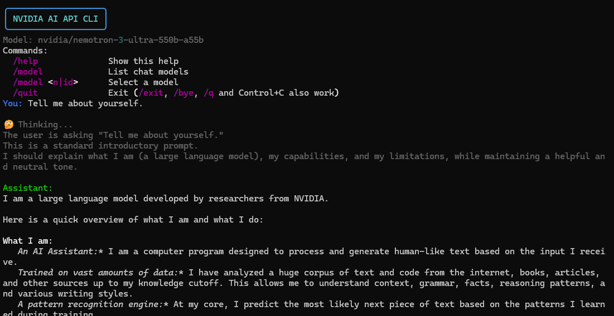

# nvidia-ai-api-cli

Command-line chat client for the [NVIDIA NIM / Integrate API](https://build.nvidia.com/models). Works on **Linux** and **Windows**.

Stream model replies in the terminal, switch models with `/model`, and remember the last selected model between sessions.

- **Repo:** [github.com/evrenater/nvidia-ai-api-cli](https://github.com/evrenater/nvidia-ai-api-cli)
- **Default model:** `nvidia/nemotron-3-ultra-550b-a55b`
- **API endpoint:** `https://integrate.api.nvidia.com/v1/chat/completions`
- **License:** [GPL-3.0](LICENSE)




---

## Features

- Streaming chat against NVIDIA-hosted models
- Live model catalog from `GET /v1/models`
- `/model` picker (list, filter, select by number or id)
- Bare number after a model list selects that entry
- Optional thinking / reasoning stream
- Syntax-highlighted fenced code blocks in the terminal
- I didn't want to store model information in user data location, better use terminal flag.
- Optional [Rich](https://github.com/Textualize/rich) UI (falls back to ANSI if missing)

---

## Requirements

- **Python 3.9+**
- Free NVIDIA API key from [build.nvidia.com](https://build.nvidia.com/)

### Dependencies

| Package    | Required | Purpose                        |
|------------|----------|--------------------------------|
| `requests` | Yes      | HTTP client for the NVIDIA API |
| `rich`     | Optional | Panel banner and nicer prompts |

```bash
pip install -r requirements.txt
```

Or:

```bash
pip install requests rich prompt_toolkit
```

---

## Install

```bash
git clone https://github.com/evrenater/nvidia-ai-api-cli.git
cd nvidia-ai-api-cli
```

### Virtual environment (recommended)

**Linux / macOS (Not tested on macOS)**

```bash
python3 -m venv .venv
source .venv/bin/activate
pip install -r requirements.txt
```

**Windows (PowerShell)**

```powershell
python -m venv .venv
.\.venv\Scripts\Activate.ps1
pip install -r requirements.txt
```

**Windows (cmd)**

```cmd
python -m venv .venv
.venv\Scripts\activate.bat
pip install -r requirements.txt
```

---

## API key

Create a key at [build.nvidia.com](https://build.nvidia.com/).

**Linux / macOS (current shell)**

```bash
export NVIDIA_API_KEY="nvapi-..."
```

Persist it in `~/.bashrc` or `~/.zshrc` if you want it every session.

**Windows PowerShell (current session)**

```powershell
$env:NVIDIA_API_KEY = "nvapi-..."
```

**Windows PowerShell (permanent for your user)**

```powershell
[System.Environment]::SetEnvironmentVariable("NVIDIA_API_KEY", "nvapi-...", "User")
```

Open a new terminal after setting a permanent variable.

Do **not** commit your key or put it in source files.

---

## Run

**Linux / macOS**

```bash
python3 chat.py
```

**Windows**

```powershell
python chat.py
```

### Optional flags (beta)

```bash
python chat.py --model nvidia/nemotron-3-super-120b-a12b
python chat.py --thinking
python chat.py --hide-thinking
python chat.py --no-stream
python chat.py --max-tokens 2048
python chat.py --temperature 0.7
python chat.py --system "You are a concise coding assistant."
```

| Flag              | Default        | Description                            |
|-------------------|----------------|----------------------------------------|
| `--model`         | saved / default| Model id                               |
| `--max-tokens`    | `4096`         | Max completion tokens                  |
| `--temperature`   | `1.0`          | Sampling temperature                   |
| `--top-p`         | `0.95`         | Nucleus sampling                       |
| `--timeout`       | `300`          | Request timeout (seconds)              |
| `--thinking`      | off            | Request thinking when the model allows |
| `--hide-thinking` | off            | Hide reasoning stream                  |
| `--no-stream`     | off            | Non-streaming replies                  |
| `--system`        | none           | System prompt for this session         |

---

## In-chat commands

| Command                         | Action                                      |
|---------------------------------|---------------------------------------------|
| `/help`                         | Show help                                   |
| `/model`                        | List chat models                            |
| `/model <n>`                    | Select by number from the last list         |
| `/model <id>`                   | Select by full model id                     |
| `/model <filter>`               | Filter list (example: `/model llama`)       |
| `/quit` `/exit` `/bye` `/q`     | Exit (Ctrl+C also works)                    |

After `/model` prints a numbered list, typing `64` and Enter selects model **#64** (only while a pick is pending).

---


## Project layout

```text
nvidia-ai-api-cli/
├── chat.py              # CLI entry point
├── requirements.txt
├── nvidia-ai-api-cli.png
├── LICENSE              # GPL-3.0
└── README.md
```

---

## Notes

- `GET /v1/models` returns the full NVIDIA catalog (chat, embeddings, vision, ASR, and more). The CLI hides non-chat entries in the default list; a full id still works with `/model <id>`.
- Not every catalog model supports `chat/completions`. If a selection fails, try another model.
- Keep `NVIDIA_API_KEY` out of git. Add a local `.env` only if you load it yourself; do not commit secrets.

---

## License

This project is licensed under the [GNU General Public License v3.0](LICENSE).
